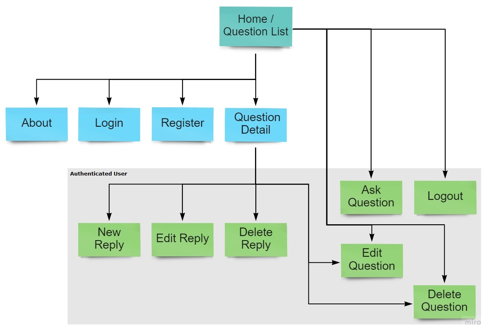

# Code Buddy

Code Buddy is a website created to allow developers to ask questions and receive relevant answers from other developers.

The main objective of the site is to allow developers to share knowledge and ideas, collaborate and help each other to find solutions to the problems they face. This is achieved by providing a platform of questions and answers, where users can search for the information they are looking for. Developers are also able to upvote or downvote the questions and answers in order to assure that relevant content gets highlighted.

Visit the deployed website [here](https://django-code-buddy.herokuapp.com/).

## Table of Contents

1. [User Experience (UX)](#user-experience-ux)
    1. [Strategy](#strategy)
        1. [Project Goals](#project-goals)
        2. [User Goals](#user-goals)
        3. [Strategy Table](#strategy-table)
    2. [Scope](#scope)
        1. [User Stories](#user-stories)
    3. [Structure](#structure)
    4. [Skeleton](#skeleton)
    5. [Surface](#surface)
2. [Features](#features)
3. [Technologies Used](#technologies-used)
4. [Testing](#testing)
5. [Deployment](#deployment)
6. [Finished Product](#finished-product)
7. [Credits](#credits)
8. [Acknowledgements](#acknowledgements)

***

## User Experience (UX)

### Strategy

#### Project Goals

* The website contains simple colors for a modern design and also to not draw attention from the content.

* Responsive design to make the website accessible on different screen sizes.

* Structure is easy to understand and navigates effortlessly.

* Site users are able to register an account in order to interact with the content.

* Site users are able to upvote or downvote the questions and answers to help identify relevant content.

#### User Goals

* As a Site Admin, I want to manage the site content.

* As a Site User, I want to be able to interact with the content.

* As a Site User, I want the information to be easy to find and read.

* As a Site User, I can create new questions and answers.

* As a Site User, I want to manage the content I created.

* As a Site User, I want to be able to help make the content more relevant.

#### Strategy Table

Opportunity / Problem | Importance | Viability / Feasibility
--- | --- | ---
Responsive design | 5 | 5
Account registration | 5 | 5
Ability to add profile picture | 3 | 2
Social media signup | 3 | 2
Create, edit and delete questions | 5 | 4
Create, edit and delete replies | 5 | 4
Ability to search for questions | 4 | 3
Add tags to the questions | 3 | 1
Upvote / downvote question and replies | 4 | 3
**Total** | **37** | **29**

### Scope

According to the strategy table, not all features can be implemented in the first release of the project. For this reason, the project will be divided in multiple phases. The first phase will include the features that have been identified in order to build the minimum viable product.

**First Phase**

* Responsive design

* Account registration

* Create, edit and delete questions

* Create, edit and delete replies

* Ability to search for questions

* Upvote / downvote question and replies

**Second Phase**

* Ability to add profile picture

* Social media signup

* Add tags to the questions

#### User Stories

### Structure

The website has been organized in a Hierarchical Tree Structure to ensure the site user navigates through the site effortlessly and intuitively. Here you can you can find the website map design.

* Header, footer and navigation bar are consistent through all pages.

* Links and forms provide clear feedback to the site user.

* The opportunity to add additional content to the website is provided for the site user once they register an account.

* A 404-error page is available.

### Skeleton

#### Wireframes

[Balsamiq](https://balsamiq.com/) has been used to showcase the appearance of the site and display the placement of the different elements whitin the pages.

Page | Desktop Version | Mobile Version
--- | --- | ---
Index / User Logged Out |  | 
Sign Up |  | 
Log In |  | 
Index / User Logged In |  | 
Ask Question |  | 
Open Question |  | 
Leave Reply |  | 

### Surface

[Back to top ⇧](#code-buddy)

## Features

[Back to top ⇧](#code-buddy)

## Technologies Used

[Back to top ⇧](#code-buddy)

## Testing

[Back to top ⇧](#code-buddy)

## Deployment

[Back to top ⇧](#code-buddy)

## Finished Product

[Back to top ⇧](#code-buddy)

## Credits

[Back to top ⇧](#code-buddy)

## Acknowledgements

[Back to top ⇧](#code-buddy)