# Code Buddy

Code Buddy is a website created to allow developers to ask questions and receive relevant answers from other developers.

The main objective of the site is to allow developers to share knowledge and ideas, collaborate and help each other to find solutions to the problems they face. This is achieved by providing a platform of questions and answers, where users can search for the information they are looking for. Developers are also able to upvote or downvote the questions and answers in order to assure that relevant content gets highlighted.

Visit the deployed website [here](https://django-code-buddy.herokuapp.com/).

## Table of Contents

1. [User Experience (UX)](#user-experience-ux)
    1. [Strategy](#strategy)
        1. [Project Goals](#project-goals)
        2. [User Goals](#user-goals)
        3. [Strategy Table](#strategy-table)
    2. [Scope](#scope)
        1. [User Stories](#user-stories)
    3. [Structure](#structure)
    4. [Skeleton](#skeleton)
    5. [Surface](#surface)
2. [Features](#features)
3. [Technologies Used](#technologies-used)
4. [Testing](#testing)
    1. [Testing User Stories](#testing-user-stories)
    2. [Code Validation](#code-validation)
    3. [Accessibility](#accessibility)
    4. [Tools Testing](#tools-testing)
    5. [Manual Testing](#manual-testing)
5. [Deployment](#deployment)
6. [Finished Product](#finished-product)
7. [Credits](#credits)
8. [Acknowledgements](#acknowledgements)

***

## User Experience (UX)

### Strategy

#### Project Goals

* The website contains simple colors for a modern design and also to not draw attention from the content.

* Responsive design to make the website accessible on different screen sizes.

* Structure is easy to understand and navigates effortlessly.

* Site users are able to register an account in order to interact with the content.

* Site users are able to upvote or downvote the questions and answers to help identify relevant content.

#### User Goals

* As a Site Admin, I want to manage the site content.

* As a Site User, I want to be able to interact with the content.

* As a Site User, I want the information to be easy to find and read.

* As a Site User, I can create new questions and answers.

* As a Site User, I want to manage the content I created.

* As a Site User, I want to be able to help make the content more relevant.

#### Strategy Table

Opportunity / Problem | Importance | Viability / Feasibility
--- | --- | ---
Responsive design | 5 | 5
Account registration | 5 | 5
Ability to add profile picture | 3 | 2
Social media signup | 3 | 2
Create, edit and delete questions | 5 | 4
Create, edit and delete replies | 5 | 4
Ability to search for questions | 4 | 3
Add tags to the questions | 3 | 1
Upvote / downvote question and replies | 4 | 3
**Total** | **37** | **29**

### Scope

According to the strategy table, not all features can be implemented in the first release of the project. For this reason, the project will be divided in multiple phases. The first phase will include the features that have been identified in order to build the minimum viable product.

**First Phase**

* Responsive design

* Account registration

* Create, edit and delete questions

* Create, edit and delete replies

* Ability to search for questions

* Upvote / downvote question and replies

**Second Phase**

* Ability to add profile picture

* Social media signup

* Add tags to the questions

#### User Stories

GitHub projects was used as my project management tool to track user stories. Using a Kanban board helped to focus on specific tasks and track the project progress.

**Start**

**Week 1**

**Week 2**

**Week 3**

### Structure

The website has been organized in a Hierarchical Tree Structure to ensure the site user navigates through the site effortlessly and intuitively. Here you can you can find the website map design.

* Header, footer and navigation bar are consistent through all pages.

* Links and forms provide clear feedback to the site user.

* The opportunity to add additional content to the website is provided for the site user once they register an account.

* A 404-error page is available.

#### Database Model

The database model has been designed using [drawsql](https://drawsql.app/). The type of database being used for the is relational database being managed using [PostgreSQL](https://www.postgresql.org/).

**Question Model**

* Title: Unique question title provided by the author.

* Author: Store the author of the question as a User foreign key.

* Content: Question details provided by the author.

* Slug: Store a unique slug to identify the question by.

* Created On: Date and time set automatically at the question's creation.

* Last updated: Date and time set automatically every time the question is updated.

* Votes score: Calculated score of the question's votes.

**Reply Model**

* Question: A foreign key from the Question model, storing the question being replied.

* Author: Store the author of the reply as a User foreign key.

* Body: Reply body with details provided by the author.

* Created On: Date and time set automatically at the reply's creation.

* Last updated: Date and time set automatically every time the reply is updated.

* Votes score: Calculated score of the reply's votes.

**QuestionVote Model**

* Voter: Foreign key from the User model, storing the user voting the question.

* Score: Score provided by the voter. The options are upvote with a value of 1 or downvote with a value of -1.

* Question: A foreign key from the Question model, storing the question being voted.

**ReplyVote Model**

* Voter: Foreign key from the User model, storing the user voting the reply.

* Score: Score provided by the voter. The options are upvote with a value of 1 or downvote with a value of -1.

* Reply: A foreign key from the Reply model, storing the question being voted.

### Skeleton

#### Wireframes

[Balsamiq](https://balsamiq.com/) has been used to showcase the appearance of the site and display the placement of the different elements whitin the pages.

Page | Desktop Version | Mobile Version
--- | --- | ---
Index / User Logged Out |  | 
Sign Up |  | 
Log In |  | 
Index / User Logged In |  | 
Ask Question |  | 
Open Question |  | 
Leave Reply |  | 

### Surface

#### Color Scheme

The colors used in the website are a teal blue color (#3F778D) for secondary buttons, navbar links, as well as for main buttons and links transitions. Charcoal (#253A47) is used for the main text, footer background, main buttons and secondary buttons and links transitions.

A platinum (#E9EDE9) for the navigation bar and card footers background, footer and buttons content. A baby powder color (#FFFFFD) is also used in the main background and cards footer as well as for input fields.

The colors are were chosen keeping in mind simplicity but also providing the website a modern design. This in order to keep the focus on the content but also appealing for the users.

#### Typography

The main font being used in the site is Nunito, with sans-serif as a fallback in case Nunito doesn't get imported correctly. Roboto, with sans-serif as a fallback is used mainly for headings and the logo has been given the Quicksand font, with sans-serif as a fallback.

Nunito and Roboto were chosen after some research on fonts that are better for reading. Specially Nunito which has been used as main font. Quicksand was used for the logo for design purposes.

[Back to top ⇧](#code-buddy)

## Features

[Back to top ⇧](#code-buddy)

## Technologies Used

[Back to top ⇧](#code-buddy)

## Testing

### Testing User Stories

#### 1. As a Site Admin I can create, read, update and delete questions and answers so that I can manage the site content

* An admin site has been provided so that the Site Admin can manage question and replies.

* Question and replies can be created, read, updated and deleted from the site.

* Questions and replies main fields are being displayed for the Site Admin to identify them easily.

* Questions and replies can be filtered and searched to narrow down a specific group.

#### 2. As a Site User I can register an account so that I can create and rate questions and replies

* Account registration has been provided for Site User.

* Registered Site Users are given the possibility to submit questions and replies.

* Registered Site Users are able to edit and delete their own questions.

* Registered Site Users are able to vote upvote and downvote questions and replies.

#### 3. As a Site User I can create new questions so that I can receive help from other users

* An Ask Question page has been provided for registered Site Users.

* A form is available in the Ask Question page for the Site Users to be able to register new questions. 

* An Ask Question button is displayed to the registered Site Users at the top of the questions list to access the Ask Question page.

#### 4. As a Site User I can edit and delete my own questions so that I can manage the questions I created

* Edit and Delete Question pages are provided for registered Site Users.

* A form is available inside those pages for the Site Users to be able to edit or delete a specific question.

* The Edit Question form is prepopulated with the current data for the user to be able to edit the content.

* A Delete Question form is provided for Site Users to confirm the deletion. 

* Edit and Delete button are displayed on those questions the user has created to access the respective page.

#### 5. As a Site User I can reply to questions so that I can help other users to find a solution

* A Leave Reply page has been provided for registered Site Users.

* A form is available in the Leave Reply page for the Site Users to be able to register new replies to the questions. 

* A Leave Reply button is displayed to the registered Site Users under the Question content inside the Question Details page. This button is used to access the Leave Reply page.

#### 6. As a Site User I can edit and delete my own replies so that I can manage the replies I created

* Edit and Delete Reply pages are provided for registered Site Users.

* A form is available inside those pages for the Site Users to be able to edit or delete a specific reply.

* The Edit Reply form is prepopulated with the current data for the user to be able to edit the content.

* A Delete Reply form is provided for Site Users to confirm the deletion. 

* Edit and Delete button are displayed on those replies the user has created to access the respective page.

#### 7. As a Site User I can upvote and downvote questions and answers so that I can give relevance to the content.

* Upvote and downvote buttons are provided for registered Site Users next to each question and reply.

* Registered Site Users can upvote, downvote or remove their votes using those buttons from the Home and Question Detail pages.

#### 8. As a Site User I can view a list of questions so that I can select one to read

* The Home page is a Question List, displaying all existing question to all Site Users.

* Questions are displayed in creation date/time order, showing the newest questions on top. 

#### 9. As a Site User I can search for specific questions so that I can easily find the information I am looking for

* A Question Search field has been provided to all Site Users in the top of all pages.

* This search field allow all Site Users to search questions using keyword(s).

* A Search Results page with a list of questions matching the searched keyword(s) is provided.

* The list gets paginated if the Search Results exceed 10 questions.

#### 10. As a Site User I can view a paginated list of questions so that I can easily select a question to view

* The Question List displayed in the Home page is paginated every 10 questions.

* Navigation buttons are provided on the bottom of each page to navigate easily between pages.

#### 11. As a Site User I can click on a question so that I can read the full question and the replies received

* A Question Detail page is provided for all Site Users to review the full question content.

* The question title in the Question List page is provided as a link so that Site Users can access the Question Detail page for each specific question.

#### 12. As a Site User I can view the replies a question received so that I can find a solutions to the question

* Question's replies are being listed inside the Question Detail page for each specific question under the question content.

 * Replies are being sorted by their rating so that Site Users can find the most relevant replies on top.

#### 13. As a Site User I can view the score on each question so that I can find the most helpful

* The question's rating is being displayed for all Site Users next to each question.

#### 14. As a Site User I can view the score on each reply so that I can find the most helpful

* The reply's rating is being displayed for all Site Users next to each reply.

* Replies are ordered by this rating so Site Users can find the most relevant replies on top

### Code Validation

#### HTML

The [W3C Markup Validator](https://validator.w3.org/) service was used to validate the HTML code of the project in order to ensure there were no syntax errors.
 
W3C Markup Validator found the following errors concerning index.html.

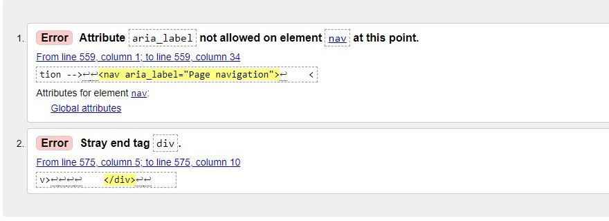

The errors were solved by removing the aria-label attribute from the nav, as well as removing the invalid closing Div tag.

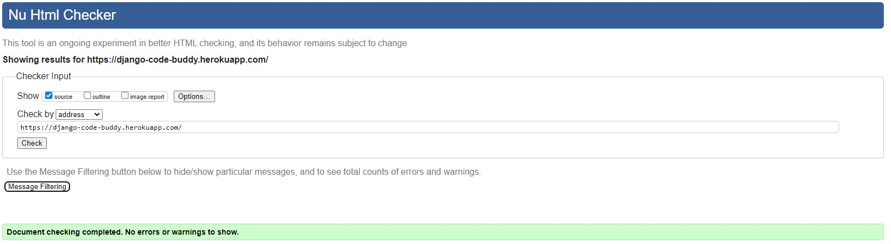

W3C Markup Validator also found a great amount of errors in pages with user input. However I found those errors to be coming from the Summernote editor. See example below:

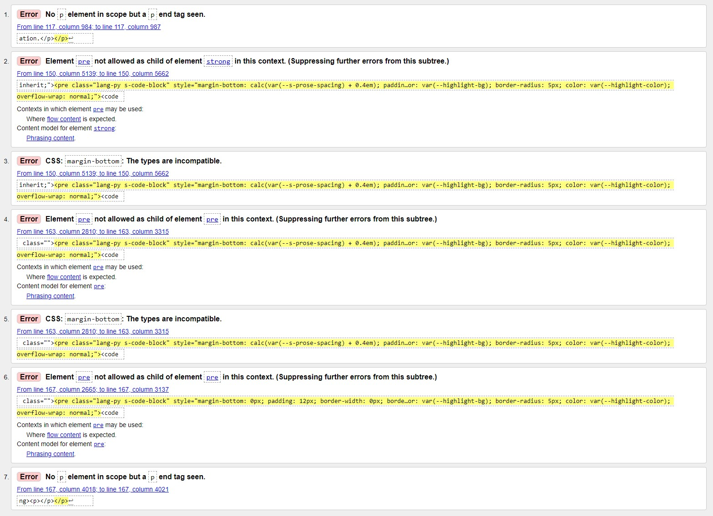

##### CSS

[W3C CSS Validator](https://jigsaw.w3.org/css-validator/) service was used to validate the CSS code of the project in order to ensure there were no syntax errors. 

W3C CSS Validator found no errors or warnings on my CSS.

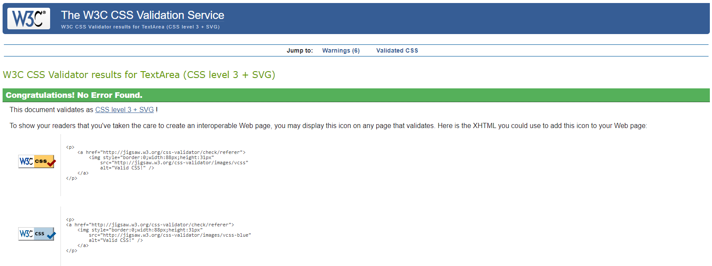

#### Pyhton

Pylint was used continuously during the development process to analyze the Python code for programming errors.

[PEP8 online](http://pep8online.com/) was further used to validate the Python code to validate the Python code for PEP8 requirements. See below the validation results and the reviewed results. 

| Location | Errors / Warnings | Code Reviewed |
| --- | --- | --- |
| ./question/admin.py | No errors / warnings |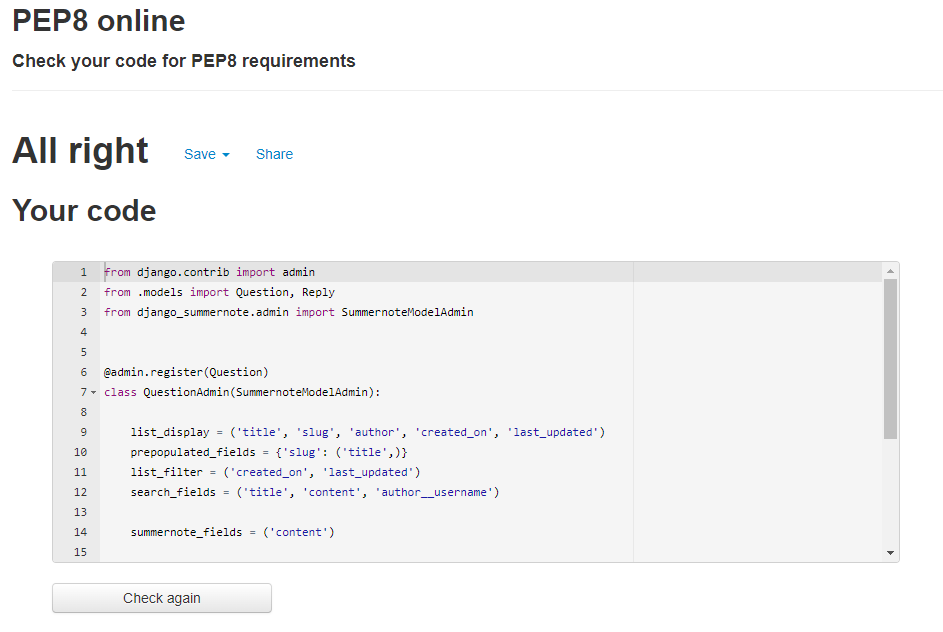 |
| ./question/forms.py |  | 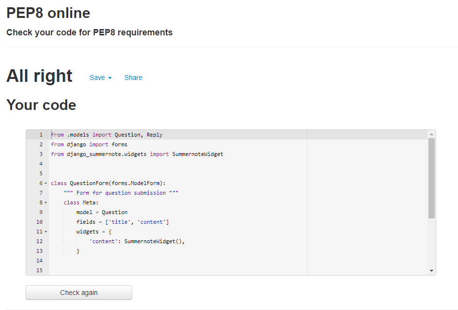 |
| ./question/models.py |  | 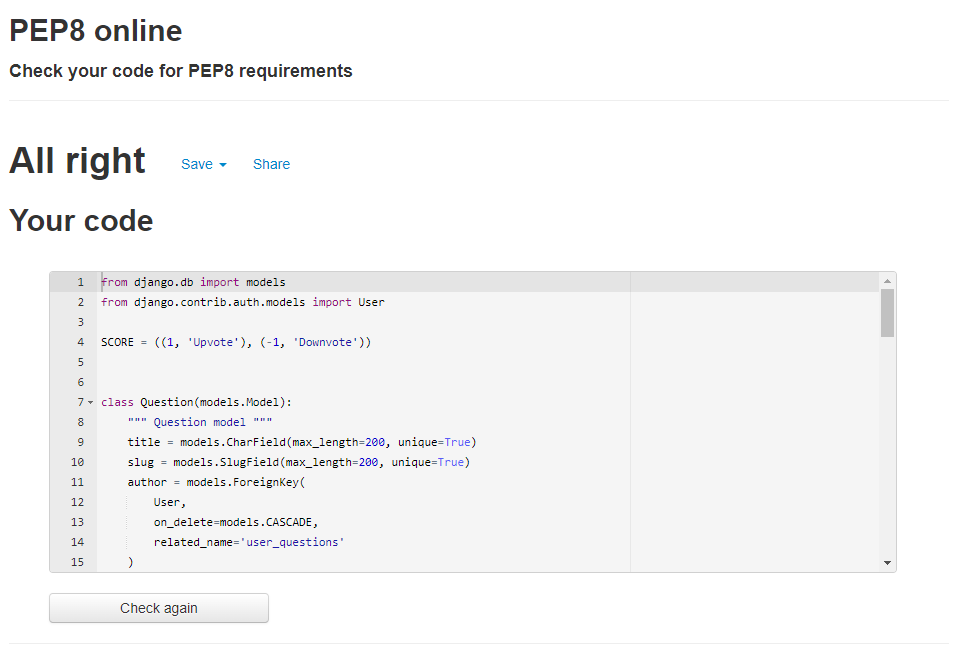 |
| ./question/urls.py | 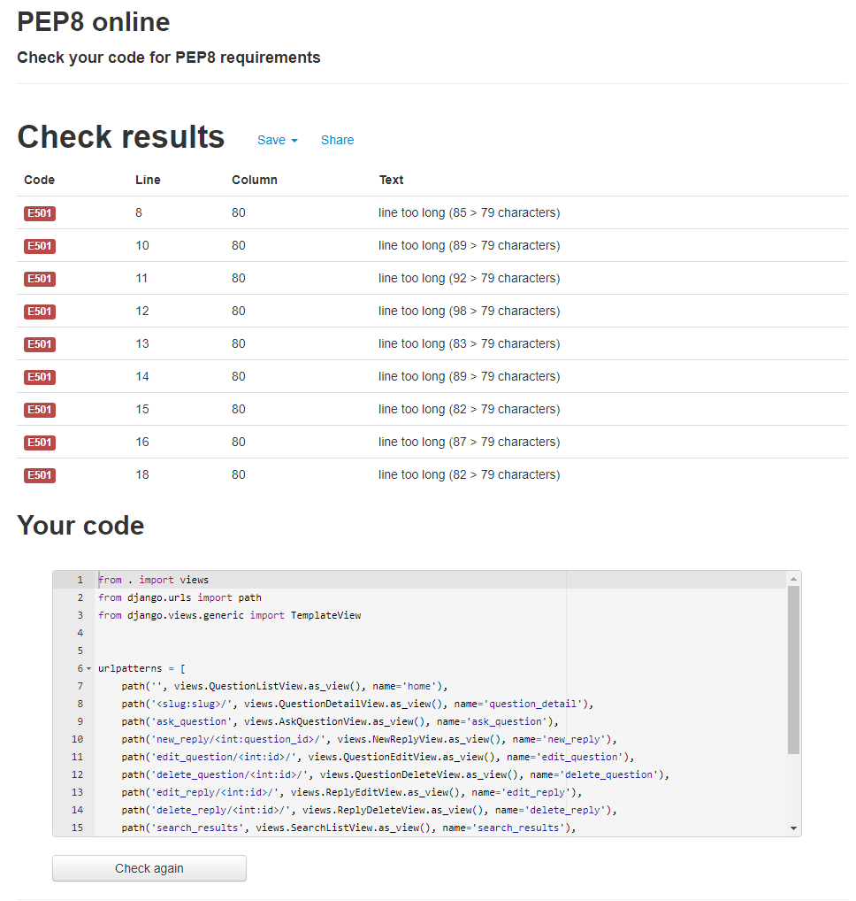 | 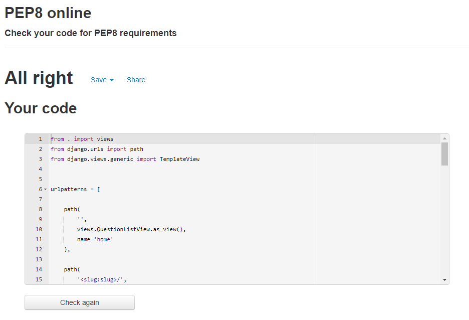 |
| ./question/views.py | 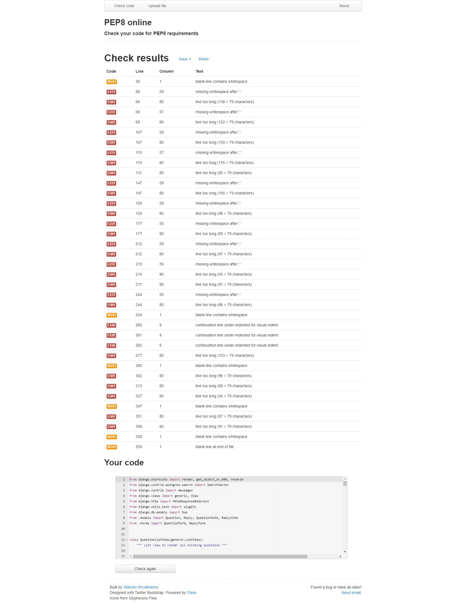 | 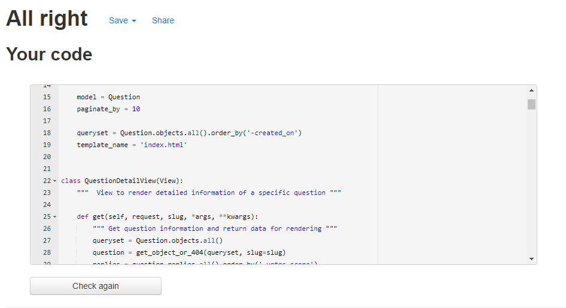 |

#### JavaScript

[JSHints JavaScript Code Quality Tool](https://jshint.com/) was used to validate the site's JavaScript code. 

No errors were found.

### Accessibility

Lighthouse in Chrome DevTools has been used to confirm that the colors and fonts being used throughout the website are easy to read and accessible. See reports in the table below:

#### Lighthouse Reports

Page | Lighthouse Report |
| --- | --- |
| Index | 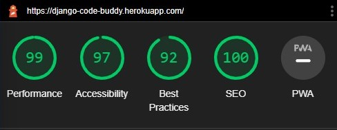 |
| About | 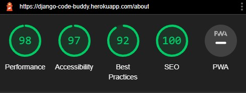 |
| Register | 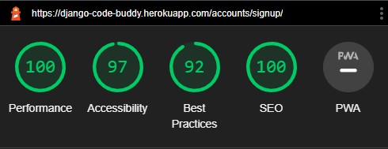 |
| Login | 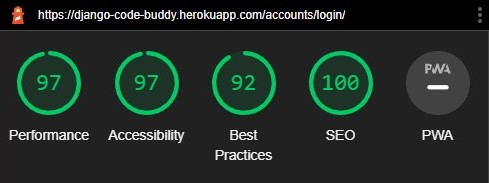 |
| Logout | 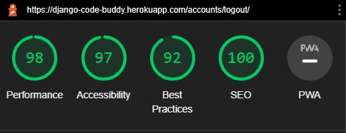 |
| Question Detail !|  |
| Ask Question | 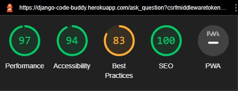 |
| Leave Reply | 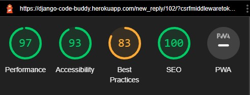 |
| Edit Question | 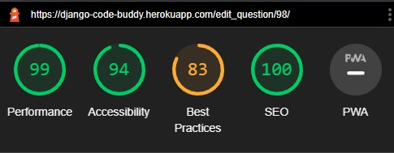 |
| Delete Question | 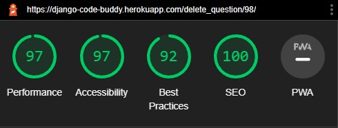 |
| Edit Reply | 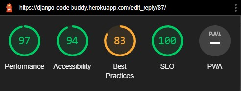 |
| Delete Reply | 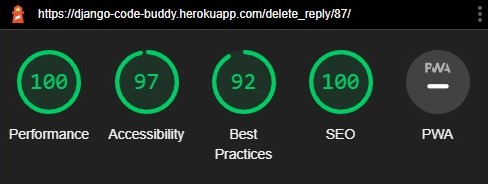 |

### Tools Testing

#### [Chrome DevTools](https://developer.chrome.com/docs/devtools/)

Chrome DevTools was used during the development process to test, explore and modify HTML elements and CSS styles used in the project.

#### Responsiveness

* [Am I Responsive?](http://ami.responsivedesign.is/#) was used to check responsiveness of the site pages across different devices.

* Chrome DevTools was used to test responsiveness in different screen sizes during the development process.

### Manual Testing

#### Browser Compatibility

Browser | Outcome | Pass/Fail | 
--- | --- | --- |
Google Chrome | No appearance, responsiveness nor functionality issues.| Pass |
Safari | No appearance, responsiveness nor functionality issues. | Pass |
Mozilla Firefox | No responsiveness nor functionality issues.| Pass |
Microsoft Edge | No appearance, responsiveness nor functionality issues. | Pass |

#### Device Compatibility

Device | Operative System |Outcome | Pass/Fail
--- | --- | --- | --- |
Dell Optiplex 7060 | Windows 11 | No appearance, responsiveness nor functionality issues. | Pass |
MacBook Pro 15" | macOS Big Sur | No appearance, responsiveness nor functionality issues. | Pass |
Dell Latitude 5300 | Windows 10 | No appearance, responsiveness nor functionality issues. | Pass |
iPad Pro 12.9" | iOS 15 | No appearance, responsiveness nor functionality issues. | Pass |
iPad Pro 10.5" | iOS 15 |No appearance, responsiveness nor functionality issues. | Pass |
iPhone XR | iOS 15 |No appearance, responsiveness nor functionality issues. | Pass |
iPhone 7 | iOS 15 |No appearance, responsiveness nor functionality issues. | Pass |

#### Test Results

**General**

<table>
    <tr>
        <th colspan=2>Feature</th>
        <th>Users</th>
        <th>Test</th>
        <th>Outcome</th>
        <th>Pass/Fail</th>
    </tr>
    <tr>
        <td rowspan=14>Navigation Bar</td>
        <td rowspan=2>Main logo link</td>
        <td rowspan=2>All</td>
        <td>Functionality</td>
        <td>Clicking the link redirects to the Home page.</td>
        <td>Pass</td>
    </tr>
    <tr>
        <td>Style</td>
        <td>N/A</td>
        <td>N/A</td>
    </tr>
    <tr>
        <td rowspan=2>Home link</td>
        <td rowspan=2>All</td>
        <td>Functionality</td>
        <td>Clicking the link redirects to the Home page.</td>
        <td>Pass</td>
    </tr>
    <tr>
        <td>Style</td>
        <td>Hover effect working as expected.</td>
        <td>Pass</td>
    </tr>
    <tr>
        <td rowspan=2>About link</td>
        <td rowspan=2>All</td>
        <td>Functionality</td>
        <td>Clicking the link redirects to the About page.</td>
        <td>Pass</td>
    </tr>
    <tr>
        <td>Style</td>
        <td>Hover effect working as expected.</td>
        <td>Pass</td>
    </tr>
    <tr>
        <td rowspan=2>Register link</td>
        <td rowspan=2>Unregistered</td>
        <td>Functionality</td>
        <td>Clicking the link redirects to the Register page.</td>
        <td>Pass</td>
    </tr>
    <tr>
        <td>Style</td>
        <td>Hover effect working as expected.</td>
        <td>Pass</td>
    </tr>
    <tr>
        <td rowspan=2>Login link</td>
        <td rowspan=2>Unregistered</td>
        <td>Functionality</td>
        <td>Clicking the link redirects to the Login page.</td>
        <td>Pass</td>
    </tr>
    <tr>
        <td>Style</td>
        <td>Hover effect working as expected.</td>
        <td>Pass</td>
    </tr>
    <tr>
        <td rowspan=2>Logout link</td>
        <td rowspan=2>Registered</td>
        <td>Functionality</td>
        <td>Clicking the link redirects to the Logout page.</td>
        <td>Pass</td>
    </tr>
    <tr>
        <td>Style</td>
        <td>Hover effect working as expected.</td>
        <td>Pass</td>
    </tr>
    <tr>
        <td rowspan=2>Hamburger Menu button </td>
        <td rowspan=2>All</td>
        <td>Functionality</td>
        <td>Clicking the button toggle navigation menu.</td>
        <td>Pass</td>
    </tr>
    <tr>
        <td>Style</td>
        <td>Responsive navigation menu on smaller screens. Hover effect working as expected.</td>
        <td>Pass</td>
    </tr>
    <tr>
        <td rowspan=4>Search Bar</td>
        <td rowspan=2>Input field</td>
        <td rowspan=2>All</td>
        <td>Functionality</td>
        <td>Pleaceholder "Search Question" shows as expected. Text can be entered in the field.</td>
        <td>Pass</td>
    </tr>
    <tr>
        <td>Style</td>
        <td>Focus effect working as expected.</td>
        <td>Pass</td>
    </tr>
    <tr>
        <td rowspan=2>Search button</td>
        <td rowspan=2>All</td>
        <td>Functionality</td>
        <td>Clicking the link redirects to the Search Results page. Input text is being posted to the Search Results page correctly.</td>
        <td>Pass</td>
    </tr>
    <tr>
        <td>Style</td>
        <td>Hover effect working as expected.</td>
        <td>Pass</td>
    </tr>
    <tr>
        <td rowspan=10>Footer</td>
        <td rowspan=2>Logo link</td>
        <td rowspan=2>All</td>
        <td>Functionality</td>
        <td>Clicking the link redirects to the home page.</td>
        <td>Pass</td>
    </tr>
    <tr>
        <td>Style</td>
        <td>Hover effect working as expected.</td>
        <td>Pass</td>
    </tr>
    <tr>
        <td rowspan=2>Facebook icon</td>
        <td rowspan=2>All</td>
        <td>Functionality</td>
        <td>Clicking the link open Facebook page on a separate tab.</td>
        <td>Pass</td>
    </tr>
    <tr>
        <td>Style</td>
        <td>Hover effect working as expected.</td>
        <td>Pass</td>
    </tr>
    <tr>
        <td rowspan=2>Instagram icon</td>
        <td rowspan=2>All</td>
        <td>Functionality</td>
        <td>Clicking the link open Instagram page on a separate tab.</td>
        <td>Pass</td>
    </tr>
    <tr>
        <td>Style</td>
        <td>Hover effect working as expected.</td>
        <td>Pass</td>
    </tr>
    <tr>
        <td rowspan=2>Youtube icon</td>
        <td rowspan=2>All</td>
        <td>Functionality</td>
        <td>Clicking the link open Youtube page on a separate tab.</td>
        <td>Pass</td>
    </tr>
    <tr>
        <td>Style</td>
        <td>Hover effect working as expected.</td>
        <td>Pass</td>
    </tr>
    <tr>
        <td rowspan=2>Twitter icon</td>
        <td rowspan=2>All</td>
        <td>Functionality</td>
        <td>Clicking the link open Twitter page on a separate tab.</td>
        <td>Pass</td>
    </tr>
    <tr>
        <td>Style</td>
        <td>Hover effect working as expected.</td>
        <td>Pass</td>
    </tr>
</table>

#### Home page 

<table>
    <tr>
        <th colspan=2>Feature</th>
        <th>Users</th>
        <th>Test</th>
        <th>Outcome</th>
        <th>Pass/Fail</th>
    </tr>
    <tr>
        <td rowspan=2>Page Buttons</td>
        <td rowspan=2>Ask Question button</td>
        <td rowspan=2>All</td>
        <td>Functionality</td>
        <td>Clicking the button redirects to the Ask Question page.</td>
        <td>Pass</td>
    </tr>
    <tr>
        <td>Style</td>
        <td>Hover effect working as expected.</td>
        <td>Pass</td>
    </tr>
    <tr>
        <td rowspan=12>Question</td>
        <td rowspan=2>Score</td>
        <td rowspan=2>All</td>
        <td>Functionality</td>
        <td>Score renders correctly.</td>
        <td>Pass</td>
    </tr>
    <tr>
        <td>Style</td>
        <td>N/A</td>
        <td>N/A</td>
    </tr>
    <tr>
        <td rowspan=2>Title link</td>
        <td rowspan=2>All</td>
        <td>Functionality</td>
        <td>Title renders correctly. Clicking the link redirects to Question Detail page for the correct question.</td>
        <td>Pass</td>
    </tr>
    <tr>
        <td>Style</td>
        <td>Hover effect working as expected.</td>
        <td>Pass</td>
    </tr>
    <tr>
        <td rowspan=2>Author</td>
        <td rowspan=2>All</td>
        <td>Functionality</td>
        <td>Author renders correctly.</td>
        <td>Pass</td>
    </tr>
    <tr>
        <td>Style</td>
        <td>N/A</td>
        <td>N/A</td>
    </tr>
    <tr>
        <td rowspan=2>Last updated</td>
        <td rowspan=2>All</td>
        <td>Functionality</td>
        <td>Date and time when the question was created display correctly.</td>
        <td>Pass</td>
    </tr>
    <tr>
        <td>Style</td>
        <td>N/A</td>
        <td>N/A</td>
    </tr>
    <tr>
        <td rowspan=2>Edit Question button</td>
        <td rowspan=2>Registered</td>
        <td>Functionality</td>
        <td>Clicking the button redirects to Edit Question page for the correct question.</td>
        <td>Pass</td>
    </tr>
    <tr>
        <td>Style</td>
        <td>Hover effect working as expected.</td>
        <td>Pass</td>
    </tr>
    <tr>
        <td rowspan=2>Delete Question button</td>
        <td rowspan=2>Registered</td>
        <td>Functionality</td>
        <td>Clicking the button redirects to Delete Question page for the correct question.</td>
        <td>Pass</td>
    </tr>
    <tr>
        <td>Style</td>
        <td>Hover effect working as expected.</td>
        <td>Pass</td>
    </tr>
    <tr>
        <td rowspan=4>Voting</td>
        <td rowspan=2>Upvote button</td>
        <td rowspan=2>Registered</td>
        <td>Functionality</td>
        <td>Clicking the button toggle the user's upvote. Score is updated by 1.</td>
        <td>Pass</td>
    </tr>
    <tr>
        <td>Style</td>
        <td>Hover effect working as expected. Button selection is not working correctly. Button stay selected/unselected for all users and not only for the current user.</td>
        <td>Fail</td>
    </tr>
    <tr>
        <td rowspan=2>Downvote button</td>
        <td rowspan=2>Registered</td>
        <td>Functionality</td>
        <td>Clicking the button toggle the user's upvote. Score is updated by -1.</td>
        <td>Pass</td>
    </tr>
    <tr>
        <td>Style</td>
        <td>Hover effect working as expected. Button selection is not working correctly. Button stay selected/unselected for all users and not only for the current user.</td>
        <td>Fail</td>
    </tr>
    <tr>
        <td rowspan=4>Site Pagination</td>
        <td rowspan=2>Pagination</td>
        <td rowspan=2>All</td>
        <td>Functionality</td>
        <td>Pagination ocurrs if more than 10 questions are listed.</td>
        <td>Pass</td>
    </tr>
    <tr>
        <td>Style</td>
        <td>N/A</td>
        <td>N/A</td>
    </tr>
    <tr>
        <td rowspan=2>Pagination Buttons</td>
        <td rowspan=2>All</td>
        <td>Functionality</td>
        <td>Clicking the buttons navigate back and forth between the pages.</td>
        <td>Pass</td>
    </tr>
    <tr>
        <td>Style</td>
        <td>Hover effect working as expected.</td>
        <td>Pass</td>
    </tr>
</table>

#### About page 

<table>
    <tr>
        <th>Feature</th>
        <th>Users</th>
        <th>Test</th>
        <th>Outcome</th>
        <th>Pass/Fail</th>
    </tr>
    <tr>
        <td rowspan=2>General</td>
        <td rowspan=2>All</td>
        <td>Functionality</td>
        <td>About page render correctly</td>
        <td>Pass</td>
    </tr>
    <tr>
        <td>Style</td>
        <td>General styling</td>
        <td>Pass</td>
    </tr>
</table>

#### Question Detail

<table>
    <tr>
        <th colspan=2>Feature</th>
        <th>Users</th>
        <th>Test</th>
        <th>Outcome</th>
        <th>Pass/Fail</th>
    </tr>
    <tr>
        <td rowspan=2>Page Buttons</td>
        <td rowspan=2>Reply Question button</td>
        <td rowspan=2>All</td>
        <td>Functionality</td>
        <td>Clicking the button redirects to the Reply Question page.</td>
        <td>Pass</td>
    </tr>
    <tr>
        <td>Style</td>
        <td>Hover effect working as expected.</td>
        <td>Pass</td>
    </tr>
    <tr>
        <td rowspan=14>Question</td>
        <td rowspan=2>Score</td>
        <td rowspan=2>All</td>
        <td>Functionality</td>
        <td>Score renders correctly.</td>
        <td>Pass</td>
    </tr>
    <tr>
        <td>Style</td>
        <td>N/A</td>
        <td>N/A</td>
    </tr>
    <tr>
        <td rowspan=2>Title</td>
        <td rowspan=2>All</td>
        <td>Functionality</td>
        <td>Title renders correctly.</td>
        <td>Pass</td>
    </tr>
    <tr>
        <td>Style</td>
        <td>N/A</td>
        <td>N/A</td>
    </tr>
    <tr>
        <td rowspan=2>Author</td>
        <td rowspan=2>All</td>
        <td>Functionality</td>
        <td>Author renders correctly.</td>
        <td>Pass</td>
    </tr>
    <tr>
        <td>Style</td>
        <td>N/A</td>
        <td>N/A</td>
    </tr>
    <tr>
        <td rowspan=2>Content</td>
        <td rowspan=2>All</td>
        <td>Functionality</td>
        <td>Content renders correctly.</td>
        <td>Pass</td>
    </tr>
    <tr>
        <td>Style</td>
        <td>N/A</td>
        <td>N/A</td>
    </tr>
    <tr>
        <td rowspan=2>Last updated</td>
        <td rowspan=2>All</td>
        <td>Functionality</td>
        <td>Date and time when the question was created display correctly.</td>
        <td>Pass</td>
    </tr>
    <tr>
        <td>Style</td>
        <td>N/A</td>
        <td>N/A</td>
    </tr>
    <tr>
        <td rowspan=2>Edit Question button</td>
        <td rowspan=2>Registered</td>
        <td>Functionality</td>
        <td>Clicking the button redirects to Edit Question page for the correct question.</td>
        <td>Pass</td>
    </tr>
    <tr>
        <td>Style</td>
        <td>Hover effect working as expected.</td>
        <td>Pass</td>
    </tr>
    <tr>
        <td rowspan=2>Delete Question button</td>
        <td rowspan=2>Registered</td>
        <td>Functionality</td>
        <td>Clicking the button redirects to Delete Question page for the correct question.</td>
        <td>Pass</td>
    </tr>
    <tr>
        <td>Style</td>
        <td>Hover effect working as expected.</td>
        <td>Pass</td>
    </tr>
        <tr>
        <td rowspan=12>Reply</td>
        <td rowspan=2>Score</td>
        <td rowspan=2>All</td>
        <td>Functionality</td>
        <td>Score renders correctly.</td>
        <td>Pass</td>
    </tr>
    <tr>
        <td>Style</td>
        <td>N/A</td>
        <td>N/A</td>
    </tr>
    <tr>
        <td rowspan=2>Body</td>
        <td rowspan=2>All</td>
        <td>Functionality</td>
        <td>Body renders correctly.</td>
        <td>Pass</td>
    </tr>
    <tr>
        <td>Style</td>
        <td>N/A</td>
        <td>N/A</td>
    </tr>
    <tr>
        <td rowspan=2>Author</td>
        <td rowspan=2>All</td>
        <td>Functionality</td>
        <td>Author renders correctly.</td>
        <td>Pass</td>
    </tr>
    <tr>
        <td>Style</td>
        <td>N/A</td>
        <td>N/A</td>
    </tr>
    <tr>
        <td rowspan=2>Last updated</td>
        <td rowspan=2>All</td>
        <td>Functionality</td>
        <td>Date and time when the question was created display correctly.</td>
        <td>Pass</td>
    </tr>
    <tr>
        <td>Style</td>
        <td>N/A</td>
        <td>N/A</td>
    </tr>
    <tr>
        <td rowspan=2>Edit Reply button</td>
        <td rowspan=2>Registered</td>
        <td>Functionality</td>
        <td>Clicking the button redirects to Edit Reply page for the correct reply.</td>
        <td>Pass</td>
    </tr>
    <tr>
        <td>Style</td>
        <td>Hover effect working as expected.</td>
        <td>Pass</td>
    </tr>
    <tr>
        <td rowspan=2>Delete Reply button</td>
        <td rowspan=2>Registered</td>
        <td>Functionality</td>
        <td>Clicking the button redirects to Delete Reply page for the correct reply.</td>
        <td>Pass</td>
    </tr>
    <tr>
        <td>Style</td>
        <td>Hover effect working as expected.</td>
        <td>Pass</td>
    </tr>
    <tr>
        <td rowspan=8>Voting</td>
        <td rowspan=2>Queston Upvote button</td>
        <td rowspan=2>Registered</td>
        <td>Functionality</td>
        <td>Clicking the button toggle the user's upvote. Score is updated by 1.</td>
        <td>Pass</td>
    </tr>
    <tr>
        <td>Style</td>
        <td>Hover effect working as expected. Button selection is not working correctly. Button stay selected/unselected for all users and not only for the current user.</td>
        <td>Fail</td>
    </tr>
    <tr>
        <td rowspan=2>Question Downvote button</td>
        <td rowspan=2>Registered</td>
        <td>Functionality</td>
        <td>Clicking the button toggle the user's upvote. Score is updated by -1.</td>
        <td>Pass</td>
    </tr>
    <tr>
        <td>Style</td>
        <td>Hover effect working as expected. Button selection is not working correctly. Button stay selected/unselected for all users and not only for the current user.</td>
        <td>Fail</td>
    </tr>
    <tr>
        <td rowspan=2>Reply Upvote button</td>
        <td rowspan=2>Registered</td>
        <td>Functionality</td>
        <td>Clicking the button toggle the user's upvote. Score is updated by 1.</td>
        <td>Pass</td>
    </tr>
    <tr>
        <td>Style</td>
        <td>Hover effect working as expected. Button selection is not working correctly. Button stay selected/unselected for all users and not only for the current user.</td>
        <td>Fail</td>
    </tr>
    <tr>
        <td rowspan=2>Reply Downvote button</td>
        <td rowspan=2>Registered</td>
        <td>Functionality</td>
        <td>Clicking the button toggle the user's upvote. Score is updated by -1.</td>
        <td>Pass</td>
    </tr>
    <tr>
        <td>Style</td>
        <td>Hover effect working as expected. Button selection is not working correctly. Button stay selected/unselected for all users and not only for the current user.</td>
        <td>Fail</td>
    </tr>
</table>

### Ask Question

<table>
    <tr>
        <th colspan=2>Feature</th>
        <th>Users</th>
        <th>Test</th>
        <th>Outcome</th>
        <th>Pass/Fail</th>
    </tr>
    <tr>
        <td rowspan=8>Question Form</td>
        <td rowspan=2>Title input</td>
        <td rowspan=2>Registered</td>
        <td>Functionality</td>
        <td>Text can be entered in the field. Validation occurs if field is left empty</td>
        <td>Pass</td>
    </tr>
    <tr>
        <td>Style</td>
        <td>Focus effect working as expected.</td>
        <td>Pass</td>
    </tr>
    <tr>
        <td rowspan=2>Content input</td>
        <td rowspan=2>Registered</td>
        <td>Functionality</td>
        <td>Summernote editor display correctly. Text can be entered in the field. Unable to validate when field is left empty. Unable to submit if this happends as form is invalid.</td>
        <td>Fail</td>
    </tr>
    <tr>
        <td>Style</td>
        <td>Focus effect working as expected.</td>
        <td>Pass</td>
    </tr>
    <tr>
        <td rowspan=2>Submit button</td>
        <td rowspan=2>Registered</td>
        <td>Functionality</td>
        <td>Clicking the button submits the form and redirects to the Home page. Submit question if valid. Message inform if the from submit successfully or not.</td>
        <td>Pass</td>
    </tr>
    <tr>
        <td>Style</td>
        <td>Hover effect working as expected.</td>
        <td>Pass</td>
    </tr>
    <tr>
        <td rowspan=2>Cancel button</td>
        <td rowspan=2>Registered</td>
        <td>Functionality</td>
        <td>Clicking the button redirects to the Home page.</td>
        <td>Pass</td>
    </tr>
    <tr>
        <td>Style</td>
        <td>Hover effect working as expected.</td>
        <td>Pass</td>
    </tr>
</table>

### Leave Reply

<table>
    <tr>
        <th colspan=2>Feature</th>
        <th>Users</th>
        <th>Test</th>
        <th>Outcome</th>
        <th>Pass/Fail</th>
    </tr>
    <tr>
        <td rowspan=6>Reply Form</td>
        <td rowspan=2>Body input</td>
        <td rowspan=2>Registered</td>
        <td>Functionality</td>
        <td>Summernote editor display correctly. Text can be entered in the field. Unable to validate when field is left empty. Unable to submit if this happends as form is invalid.</td>
        <td>Fail</td>
    </tr>
    <tr>
        <td>Style</td>
        <td>Focus effect working as expected.</td>
        <td>Pass</td>
    </tr>
    <tr>
        <td rowspan=2>Submit button</td>
        <td rowspan=2>Registered</td>
        <td>Functionality</td>
        <td>Clicking the button submits the form and redirects to the originating page. Submit question if valid. Message inform if the from submit successfully or not</td>
        <td>Pass</td>
    </tr>
    <tr>
        <td>Style</td>
        <td>Hover effect working as expected.</td>
        <td>Pass</td>
    </tr>
    <tr>
        <td rowspan=2>Cancel button</td>
        <td rowspan=2>Registered</td>
        <td>Functionality</td>
        <td>Clicking the button redirects to the Home page.</td>
        <td>Pass</td>
    </tr>
    <tr>
        <td>Style</td>
        <td>Hover effect working as expected.</td>
        <td>Pass</td>
    </tr>
</table>

[Back to top ⇧](#code-buddy)

## Deployment

[Back to top ⇧](#code-buddy)

## Finished Product

[Back to top ⇧](#code-buddy)

## Credits

[Back to top ⇧](#code-buddy)

## Acknowledgements

[Back to top ⇧](#code-buddy)