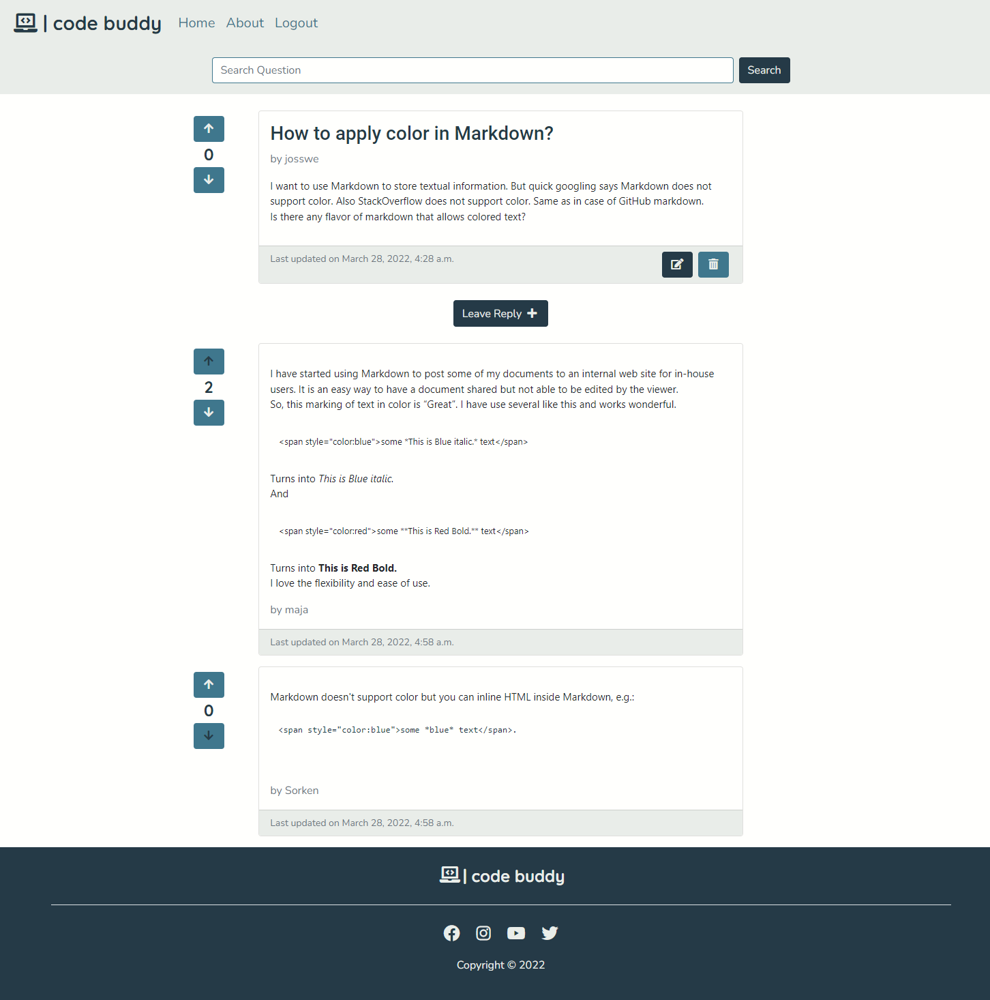
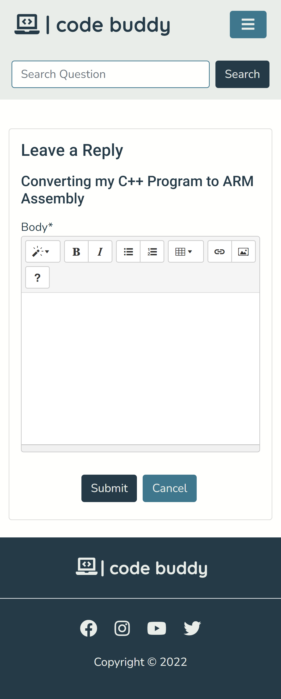
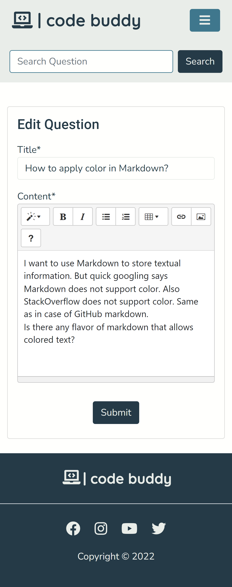
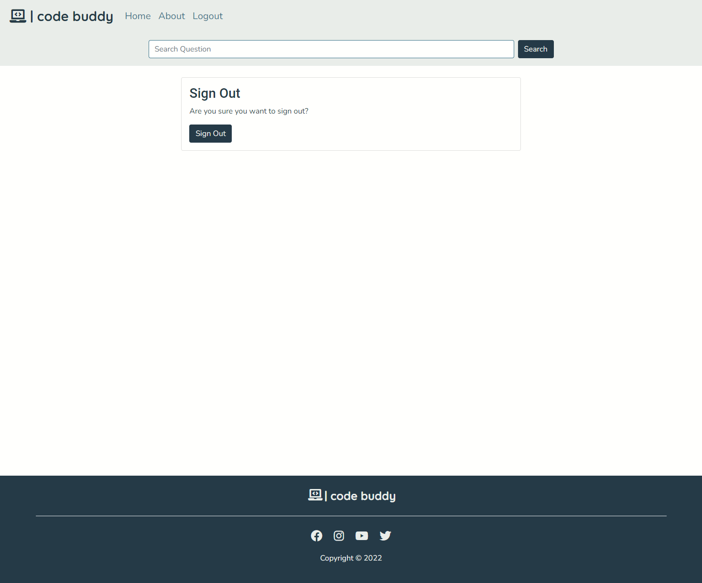

# Code Buddy


Code Buddy is a website created to allow developers to ask questions and receive relevant answers from other developers.

The main objective of the site is to allow developers to share knowledge and ideas, collaborate and help each other to find solutions to the problems they face. This is achieved by providing a platform of questions and answers, where users can search for the information they are looking for. Developers are also able to upvote or downvote the questions and answers in order to assure that relevant content gets highlighted.

Visit the deployed website [here](https://django-code-buddy.herokuapp.com/).


## Table of Contents

1. [User Experience (UX)](#user-experience-ux)
    1. [Strategy](#strategy)
        1. [Project Goals](#project-goals)
        2. [User Goals](#user-goals)
        3. [Strategy Table](#strategy-table)
    2. [Scope](#scope)
        1. [User Stories](#user-stories)
    3. [Structure](#structure)
    4. [Skeleton](#skeleton)
    5. [Surface](#surface)
2. [Features](#features)
    1. [General](#general)
    2. [Home Page](#home-page)
    3. [About Page](#about-page)
    4. [Search Results Page](#search-results-page)
    5. [Question Detail Page](#question-detail-page)
    6. [Ask Question Page](#ask-question-page)
    7. [Leave Reply Page](#leave-reply-page)
    8. [Edit Question Page](#edit-question-page)
    9. [Delete Question Page](#delete-question-page)
    10. [Edit Reply Page](#edit-reply-page)
    11. [Delete Reply Page](#delete-reply-page)
    12. [Authentication Pages](#authentication-pages)
3. [Technologies Used](#technologies-used)
    1. [Languages Used](#languages-used)
    2. [Libraries and Frameworks](#languages-and-frameworks)
    3. [Packages / Dependecies Installed](#packages--dependecies-installed)
    4. [Database Management](#database-management)
    5. [Tools and Programs](#tools-and-programs)
4. [Testing](#testing)
    1. [Go to TESTING.md](https://github.com/josswe26/code-buddy/blob/main/TESTING.md#code-buddy-testing)
5. [Deployment](#deployment)
6. [Finished Product](#finished-product)
7. [Credits](#credits)
8. [Known Bugs](#known-bugs)
9. [Acknowledgements](#acknowledgements)


***


## User Experience (UX)

### Strategy

#### Project Goals

* The website contains simple colors for a modern design and also to not draw attention from the content.

* Responsive design to make the website accessible on different screen sizes.

* Structure is easy to understand and navigates effortlessly.

* Site users are able to register an account in order to interact with the content.

* Site users are able to upvote or downvote the questions and answers to help identify relevant content.


#### User Goals

* As a Site Admin, I want to manage the site content.

* As a Site User, I want to be able to interact with the content.

* As a Site User, I want the information to be easy to find and read.

* As a Site User, I can create new questions and answers.

* As a Site User, I want to manage the content I created.

* As a Site User, I want to be able to help make the content more relevant.


#### Strategy Table

Opportunity / Problem | Importance | Viability / Feasibility
--- | --- | ---
Responsive design | 5 | 5
Account registration | 5 | 5
Ability to add profile picture | 3 | 2
Social media signup | 3 | 2
Create, edit and delete questions | 5 | 4
Create, edit and delete replies | 5 | 4
Ability to search for questions | 4 | 3
Add tags to the questions | 3 | 1
Upvote / downvote question and replies | 4 | 3
**Total** | **37** | **29**


### Scope

According to the strategy table, not all features can be implemented in the first release of the project. For this reason, the project will be divided in multiple phases. The first phase will include the features that have been identified in order to build the minimum viable product.

**First Phase**

* Responsive design

* Account registration

* Create, edit and delete questions

* Create, edit and delete replies

* Ability to search for questions

* Upvote / downvote question and replies

**Second Phase**

* Ability to add profile picture

* Social media signup

* Add tags to the questions


#### User Stories

GitHub projects was used as my project management tool to track user stories. Using a Kanban board helped to focus on specific tasks and track the project progress.

**Start**


**Week 1**


**Week 2**


**Week 3**


### Structure

The website has been organized in a Hierarchical Tree Structure to ensure the site user navigates through the site effortlessly and intuitively. Here you can you can find the website map design.


* Header, footer and navigation bar are consistent through all pages.

* Links and forms provide clear feedback to the site user.

* The opportunity to add additional content to the website is provided for the site user once they register an account.

* A 404-error page is available.


#### Database Model

The database model has been designed using [drawsql](https://drawsql.app/). The type of database being used for the is relational database being managed using [PostgreSQL](https://www.postgresql.org/).


**Question Model**

* Title: Unique question title provided by the author.

* Author: Store the author of the question as a User foreign key.

* Content: Question details provided by the author.

* Slug: Store a unique slug to identify the question by.

* Created On: Date and time set automatically at the question's creation.

* Last updated: Date and time set automatically every time the question is updated.

* Votes score: Calculated score of the question's votes.

**Reply Model**

* Question: A foreign key from the Question model, storing the question being replied.

* Author: Store the author of the reply as a User foreign key.

* Body: Reply body with details provided by the author.

* Created On: Date and time set automatically at the reply's creation.

* Last updated: Date and time set automatically every time the reply is updated.

* Votes score: Calculated score of the reply's votes.

**QuestionVote Model**

* Voter: Foreign key from the User model, storing the user voting the question.

* Score: Score provided by the voter. The options are upvote with a value of 1 or downvote with a value of -1.

* Question: A foreign key from the Question model, storing the question being voted.

**ReplyVote Model**

* Voter: Foreign key from the User model, storing the user voting the reply.

* Score: Score provided by the voter. The options are upvote with a value of 1 or downvote with a value of -1.

* Reply: A foreign key from the Reply model, storing the question being voted.


### Skeleton

#### Wireframes

[Balsamiq](https://balsamiq.com/) has been used to showcase the appearance of the site and display the placement of the different elements whitin the pages.

Page | Desktop Version | Mobile Version
--- | --- | ---
Index / User Logged Out |  | 
Sign Up |  | 
Log In |  | 
Index / User Logged In |  | 
Ask Question |  | 
Open Question |  | 
Leave Reply |  | 


### Surface

#### Color Scheme


The colors used in the website are a teal blue color (#3F778D) for secondary buttons, navbar links, as well as for main buttons and links transitions. Charcoal (#253A47) is used for the main text, footer background, main buttons and secondary buttons and links transitions.

A platinum (#E9EDE9) for the navigation bar and card footers background, footer and buttons content. A baby powder color (#FFFFFD) is also used in the main background and cards footer as well as for input fields.

The colors are were chosen keeping in mind simplicity but also providing the website a modern design. This in order to keep the focus on the content but also appealing for the users.


#### Typography

The main font being used in the site is Nunito, with sans-serif as a fallback in case Nunito doesn't get imported correctly. Roboto, with sans-serif as a fallback is used mainly for headings and the logo has been given the Quicksand font, with sans-serif as a fallback.

Nunito and Roboto were chosen after some research on fonts that are better for reading. Specially Nunito which has been used as main font. Quicksand was used for the logo for design purposes.

[Back to top ⇧](#code-buddy)


## Features

### General

* The website has been designed from a mobile first perspective.

* Responsive design across all device sizes.

* Navigation Bar


    *  Contains the main logo and section links.

    * The navigation bar contains links to all sections to facilitate navigation across the site. It also has a hover effect that changes color to provide feedback to the Site User for a better user experience.

* Search bar


    * Provide the Site User an input field and a Search button to be able to search for specific questions.

* Footer
  

    * The footer includes a logo and link to social media channels.


### Home Page

* Question list


    * Display a paginated list of all the question and its relevant information for the user to identify.

    * Provide the Site User with a link to the detailed question.

    * Question score as well as voting possibilities for registered users is provided next to the question.

    * For registered users, a Ask Question button is provided to allow the user to access the Ask Question Page to create new questions.

    * Edit and Question buttons are provided for the questions the registered Site User has created.


### About Page


* Provide relevant information about the website's objective.


### Search Results Page


* Display information about the Search being handled

* Display a paginated list of the questions matching the search and its relevant information for the user to identify.


### Question Detail Page


* Display the full question a well as a list of its replies.

* Question and reply scores as well as voting possibilities for registered users is provided next to each item.

* For registered users, a Leave Reply button is provided to allow the user to access the Leave Reply page to create a new reply to the question.

 * Edit and Question buttons are provided for the questions and replies the registered Site User has created.


### Ask Question Page


* Provide a form to allow registered Site Users to create a new question.

### Leave Reply Page


* Provide a form to allow registered Site Users to create a new reply to the questions.


### Edit Question Page


* Provide a prepopulated form to allow the Site User to edit a question they created.


### Delete Question Page


* Provide a form to allow the Site User to delete a question they created.


### Edit Reply Page


* Provide a prepopulated form to allow the Site User to edit a reply they created.


### Delete Reply Page


* Provide a form to allow the Site User to delete a reply they created.


### Authentication Pages

Page | Purpose | Image |
--- | --- | --- |
Register | Allow the Site User to sign up an account for the website. |  |
Login | Allow the Site User to sign in with their account. |  |
Logout | Allow the Site User to sign out from their account. |  |


[Back to top ⇧](#code-buddy)


## Technologies Used

### Languages Used

* [HTML5](https://en.wikipedia.org/wiki/HTML)
* [CSS3](https://en.wikipedia.org/wiki/CSS)
* [JavaScript](https://en.wikipedia.org/wiki/JavaScript)
* [Python](https://en.wikipedia.org/wiki/Python_(programming_language))


### Libraries and Frameworks

* [Django](https://www.djangoproject.com/)   
    * Django was used as web framework.

* [Django Template](https://jinja.palletsprojects.com)  
    * Django Template was used as a templating language for Django to display backend data to HTML.
   
* [Bootstrap 5](https://getbootstrap.com/docs/5.0/getting-started/introduction/)  
    * Bootstrap 5 was used throughout the website to help with styling and responsiveness.

* [Google Fonts](https://fonts.google.com)  
    * Google fonts was used to import the fonts into the html file, and were used on all parts of the site.

* [Font Awesome](https://fontawesome.com)  
    * Font Awesome was used throughout the website to add icons for aesthetic and UX purposes. 

* [jQuery 3.6.0](https://jquery.com/)  
    * jQuery was used as a JavaScript library to help writing less JavaScript code.  


### Packages / Dependecies Installed

* [Django Allauth](https://django-allauth.readthedocs.io/en/latest/)  
    * Django Allauth was used for user authentication, registration, and account management.

* [Django Crispy Form](https://django-crispy-forms.readthedocs.io/en/latest/)   
    * Django Crispy Form was used to control the rendering of the forms. 
 
* [Gunicorn](https://gunicorn.org/)  
    * Gunicorn was used as Python WSGI HTTP Server for UNIX to support the deployment of Django application.  

* [Summernote](https://summernote.org/) 
    * Summernote has been used as WYSIWYG editor.

* [Cloudinary](https://cloudinary.com/)
    * Cloudinary has been used as image management solution

### Database Management
* [Heroku Postgres](https://www.heroku.com/postgres)   
    * Heroku Postgres database was used in production, as a service based on PostgreSQL provided by Heroku.


### Tools and Programs

* [Git](https://git-scm.com)  
    * Git was used for version control by utilizing the Gitpod terminal to commit to Git and Push to GitHub. 

* [GitPod](https://gitpod.io/)
     * GitPod was used for writing code, committing, and then pushing to GitHub.

* [GitHub](https://github.com)  
   GitHub was used to store the projects code after being pushed from Git. 

* [Heroku](https://www.heroku.com)   
    * Heroku was used to deploy the website.

* [Am I Responsive](ami.responsivedesign.is)  
    * Am I Responsive was used to preview the website across a variety of popular devices.

* [Tiny PNG](https://tinypng.com)    
    * Tiny PNG was used to reduce the file size of the images.

* [Coolors](https://coolors.co)  
    * Coolors was used to create a color scheme for the website.

* [Balsamiq](https://balsamiq.com/)
     * Balsamiq was used to create the wireframes during the design phase of the project

* [Chrome DevTools](https://developer.chrome.com/docs/devtools/)
    * Chrome DevTools was used during development process for code review and to test responsiveness.

* [W3C Markup Validator](https://validator.w3.org/)
    * W3C Markup Validator was used to validate the HTML code.

* [W3C CSS Validator](https://jigsaw.w3.org/css-validator/)
    * W3C CSS Validator was used to validate the CSS code.

* [JSHint](https://jshint.com/) 
    * The JSHints JavaScript Code Quality Tool was used to validate the site's JavaScript code.

* [Favicon.cc](https://www.favicon.cc/) 
    * Favicon.cc was used to create the site favicon.

[Back to top ⇧](#code-buddy)

## Testing

The testing documentation can be found [here](https://github.com/josswe26/code-buddy/blob/main/TESTING.md#code-buddy-testing).


[Back to top ⇧](#code-buddy)

## Deployment

This project was developed using a [GitPod](https://gitpod.io/) workspace. The code was commited to [Git](https://git-scm.com/) and pushed to [GitHub](https://github.com/") using the terminal.

### Deploying on Heroku
To deploy this page to Heroku from its GitHub repository, the following steps were taken:

1. Create the Heroku App:
    - Select "Create new app" in Heroku.
    - Choose a name for your app and select the location.

2. Attach the Postgres database:
    - In the Resources tab, under add-ons, type in Postgres and select the Heroku Postgres option.

3. Prepare the environment and settings.py file:
    * In the Settings tab, click on Reveal Config Vars and copy the url next to DATABASE_URL.
    * In your GitPod workspace, create an env.py file in the main directory. 
    * Add the DATABASE_URL value and your chosen SECRET_KEY value to the env.py file.
    * Add the SECRET_KEY value to the Config Vars in Heroku.
    * Update the settings.py file to import the env file and add the SECRETKEY and DATABASE_URL file paths.
    * Update the Config Vars with the Cloudinary url, adding into the settings.py file also.
    * In settings.py add the following sections:
        * Cloudinary to the INSTALLED_APPS list
        * STATICFILE_STORAGE
        * STATICFILES_DIRS
        * STATIC_ROOT
        * MEDIA_URL
        * DEFAULT_FILE_STORAGE
        * TEMPLATES_DIR
        * Update DIRS in TEMPLATES with TEMPLATES_DIR
        * Update ALLOWED_HOSTS with ['app_name.heroku.com', 'localhost']

4. Store Static and Media files in Cloudinary and Deploy to Heroku:
    - Create three directories in the main directory; media, storage and templates.
    - Create a file named "Procfile" in the main directory and add the following:
        - web: gunicorn project-name.wsgi
    - Go to Deploy tab on Heroku and connect to the GitHub, then to the required recpository.
    Click on Delpoy Branch and wait for the build to load. When the build is complete, the app can be opened through Heroku.

### Forking the Repository
By forking the GitHub Repository we make a copy of the original repository on our GitHub account to view and/or make changes without affecting the original repository by using the following steps...

1. Log into [GitHub](https://github.com/login) or [create an account](https://github.com/join).
2. Locate the [GitHub Repository](https://github.com/josswe26/code-buddy).
3. At the top of the repository, on the right side of the page, select "Fork"
4. You should now have a copy of the original repository in your GitHub account.

### Creating a Clone
How to run this project locally:
1. Install the [GitPod Browser](https://www.gitpod.io/docs/browser-extension/ "Link to Gitpod Browser extension download") Extension for Chrome.
2. After installation, restart the browser.
3. Log into [GitHub](https://github.com/login "Link to GitHub login page") or [create an account](https://github.com/join "Link to GitHub create account page").
2. Locate the [GitHub Repository](https://github.com/josswe26/code-buddy).
5. Click the green "GitPod" button in the top right corner of the repository.
This will trigger a new gitPod workspace to be created from the code in github where you can work locally.

How to run this project within a local IDE, such as VSCode:

1. Log into [GitHub](https://github.com/login) or [create an account](https://github.com/join).
2. Locate the [GitHub Repository](https://github.com/josswe26/code-buddy).
3. Under the repository name, click "Clone or download".
4. In the Clone with HTTPs section, copy the clone URL for the repository.
5. In your local IDE open the terminal.
6. Change the current working directory to the location where you want the cloned directory to be made.
7. Type 'git clone', and then paste the URL you copied in Step 3.
```
git clone https://github.com/josswe26/code-buddy
```
8. Press Enter. Your local clone will be created.

Further reading and troubleshooting on cloning a repository from GitHub [here](https://docs.github.com/en/free-pro-team@latest/github/creating-cloning-and-archiving-repositories/cloning-a-repository)


[Back to top ⇧](#code-buddy)

## Finished Product

Page | Desktop | Mobile |
--- | --- | --- |
| Home |  |  |
| About |  |  |
| Search Results |  |  |
| Question Detail | |  |
| Ask Question | |  |
| Leave Reply | |  |
| Edit Question |  |  |
| Delete Question | |  |
| Edit Reply | |  |
| Delete Reply | |  |
| Sign Up | |  |
| Sign In | |  |
| Sign Out | |  |
| 404 Error | |  |


[Back to top ⇧](#code-buddy)

## Credits

### Content

* Website content was written by the developer.
* Example questions and replies were taken from [Stack Overflow](https://stackoverflow.com/)-

### Media

* [Pexels](https://www.pexels.com/)

    * About Page image: Taken by [Buro Millennial](https://www.pexels.com/@buro-millennial-636760/).

* [Unsplash](https://unsplash.com/)

    * 404 Error Page image: Taken by [Tai Bui](https://unsplash.com/@agforl24).

### Code

* [Stack Overflow](https://stackoverflow.com/) and [W3Schools](https://www.w3schools.com/) were consulted on a regular basis for inspiration and sometimes to be able to better understand the code being implement.

* Message implementation an dismissal code is taken from [Code Institute](https://codeinstitute.net/)'s django-blog project.

[Back to top ⇧](#code-buddy)

## Known Bugs

* Upvote/downvote button selection stay the same for all users. This do to an error in the logic. Even though the developer has an idea on how to solve the issue. The solution is yet to be implemented due lack of time.

* The same applies for pagination is Search Results page which is currently not working.

* A known issue with Summernote field validation is present in the project. An invalid form will be posted if the field is empty. A message will however be displayed, informing the user that there has been a problem with the submission.

[Back to top ⇧](#code-buddy)

## Acknowledgements

* My partner, for her unconditional love, help and continued support in all aspects of life, specially when I did not have time for anything else than to work with this project. You made it possible!

* My friend, Miguel, for being always there to help, no matter what time of the day.

* My tutor, Marcel, for his invaluable support, feedback and guidance through the whole process.

* Code Institute and its amazing Slack community for their support and providing me with the necessary knowledge to complete this project.

[Back to top ⇧](#code-buddy)