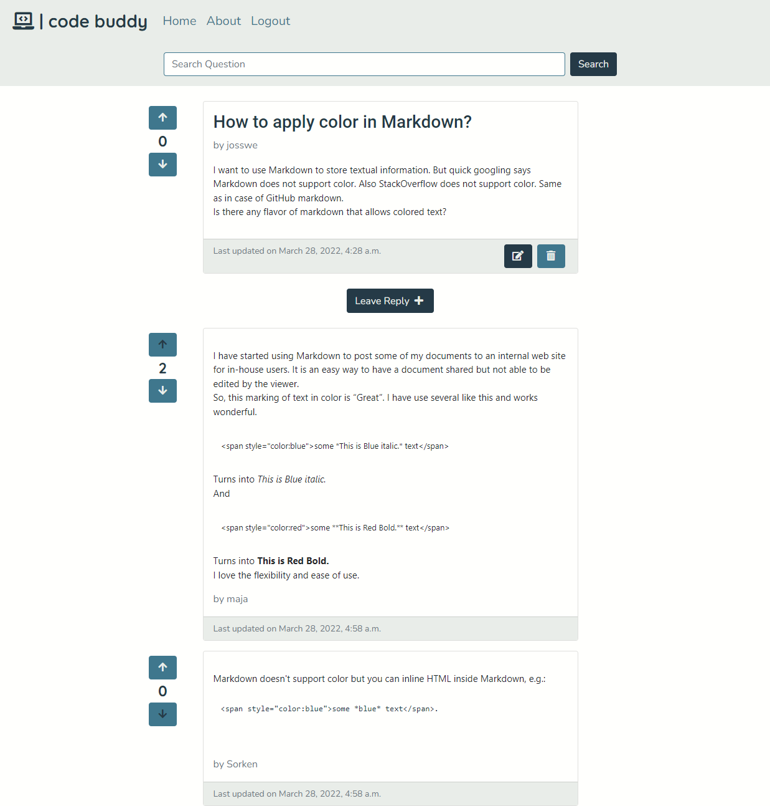

# Code Buddy

Code Buddy is a website created to allow developers to ask questions and receive relevant answers from other developers.

The main objective of the site is to allow developers to share knowledge and ideas, collaborate and help each other to find solutions to the problems they face. This is achieved by providing a platform of questions and answers, where users can search for the information they are looking for. Developers are also able to upvote or downvote the questions and answers in order to assure that relevant content gets highlighted.

Visit the deployed website [here](https://django-code-buddy.herokuapp.com/).

## Table of Contents

1. [User Experience (UX)](#user-experience-ux)
    1. [Strategy](#strategy)
        1. [Project Goals](#project-goals)
        2. [User Goals](#user-goals)
        3. [Strategy Table](#strategy-table)
    2. [Scope](#scope)
        1. [User Stories](#user-stories)
    3. [Structure](#structure)
    4. [Skeleton](#skeleton)
    5. [Surface](#surface)
2. [Features](#features)
    1. [General](#general)
    2. [Home Page](#home-page)
    3. [About Page](#about-page)
    4. [Search Results Page](#search-results-page)
    5. [Question Detail Page](#question-detail-page)
    6. [Ask Question Page](#ask-question-page)
    7. [Leave Reply Page](#leave-reply-page)
    8. [Edit Question Page](#edit-question-page)
    9. [Delete Question Page](#delete-question-page)
    10. [Edit Reply Page](#edit-reply-page)
    11. [Delete Reply Page](#delete-reply-page)
    12. [Authentication Pages](#authentication-pages)
3. [Technologies Used](#technologies-used)
4. [Testing](#testing)
    1. [Go to TESTING.md](https://github.com/josswe26/code-buddy/blob/main/TESTING.md#code-buddy-testing)
5. [Deployment](#deployment)
6. [Finished Product](#finished-product)
7. [Credits](#credits)
8. [Acknowledgements](#acknowledgements)

***

## User Experience (UX)

### Strategy

#### Project Goals

* The website contains simple colors for a modern design and also to not draw attention from the content.

* Responsive design to make the website accessible on different screen sizes.

* Structure is easy to understand and navigates effortlessly.

* Site users are able to register an account in order to interact with the content.

* Site users are able to upvote or downvote the questions and answers to help identify relevant content.

#### User Goals

* As a Site Admin, I want to manage the site content.

* As a Site User, I want to be able to interact with the content.

* As a Site User, I want the information to be easy to find and read.

* As a Site User, I can create new questions and answers.

* As a Site User, I want to manage the content I created.

* As a Site User, I want to be able to help make the content more relevant.

#### Strategy Table

Opportunity / Problem | Importance | Viability / Feasibility
--- | --- | ---
Responsive design | 5 | 5
Account registration | 5 | 5
Ability to add profile picture | 3 | 2
Social media signup | 3 | 2
Create, edit and delete questions | 5 | 4
Create, edit and delete replies | 5 | 4
Ability to search for questions | 4 | 3
Add tags to the questions | 3 | 1
Upvote / downvote question and replies | 4 | 3
**Total** | **37** | **29**

### Scope

According to the strategy table, not all features can be implemented in the first release of the project. For this reason, the project will be divided in multiple phases. The first phase will include the features that have been identified in order to build the minimum viable product.

**First Phase**

* Responsive design

* Account registration

* Create, edit and delete questions

* Create, edit and delete replies

* Ability to search for questions

* Upvote / downvote question and replies

**Second Phase**

* Ability to add profile picture

* Social media signup

* Add tags to the questions

#### User Stories

GitHub projects was used as my project management tool to track user stories. Using a Kanban board helped to focus on specific tasks and track the project progress.

**Start**

**Week 1**

**Week 2**

**Week 3**

### Structure

The website has been organized in a Hierarchical Tree Structure to ensure the site user navigates through the site effortlessly and intuitively. Here you can you can find the website map design.

* Header, footer and navigation bar are consistent through all pages.

* Links and forms provide clear feedback to the site user.

* The opportunity to add additional content to the website is provided for the site user once they register an account.

* A 404-error page is available.

#### Database Model

The database model has been designed using [drawsql](https://drawsql.app/). The type of database being used for the is relational database being managed using [PostgreSQL](https://www.postgresql.org/).

**Question Model**

* Title: Unique question title provided by the author.

* Author: Store the author of the question as a User foreign key.

* Content: Question details provided by the author.

* Slug: Store a unique slug to identify the question by.

* Created On: Date and time set automatically at the question's creation.

* Last updated: Date and time set automatically every time the question is updated.

* Votes score: Calculated score of the question's votes.

**Reply Model**

* Question: A foreign key from the Question model, storing the question being replied.

* Author: Store the author of the reply as a User foreign key.

* Body: Reply body with details provided by the author.

* Created On: Date and time set automatically at the reply's creation.

* Last updated: Date and time set automatically every time the reply is updated.

* Votes score: Calculated score of the reply's votes.

**QuestionVote Model**

* Voter: Foreign key from the User model, storing the user voting the question.

* Score: Score provided by the voter. The options are upvote with a value of 1 or downvote with a value of -1.

* Question: A foreign key from the Question model, storing the question being voted.

**ReplyVote Model**

* Voter: Foreign key from the User model, storing the user voting the reply.

* Score: Score provided by the voter. The options are upvote with a value of 1 or downvote with a value of -1.

* Reply: A foreign key from the Reply model, storing the question being voted.

### Skeleton

#### Wireframes

[Balsamiq](https://balsamiq.com/) has been used to showcase the appearance of the site and display the placement of the different elements whitin the pages.

Page | Desktop Version | Mobile Version
--- | --- | ---
Index / User Logged Out |  | 
Sign Up |  | 
Log In |  | 
Index / User Logged In |  | 
Ask Question |  | 
Open Question |  | 
Leave Reply |  | 

### Surface

#### Color Scheme

The colors used in the website are a teal blue color (#3F778D) for secondary buttons, navbar links, as well as for main buttons and links transitions. Charcoal (#253A47) is used for the main text, footer background, main buttons and secondary buttons and links transitions.

A platinum (#E9EDE9) for the navigation bar and card footers background, footer and buttons content. A baby powder color (#FFFFFD) is also used in the main background and cards footer as well as for input fields.

The colors are were chosen keeping in mind simplicity but also providing the website a modern design. This in order to keep the focus on the content but also appealing for the users.

#### Typography

The main font being used in the site is Nunito, with sans-serif as a fallback in case Nunito doesn't get imported correctly. Roboto, with sans-serif as a fallback is used mainly for headings and the logo has been given the Quicksand font, with sans-serif as a fallback.

Nunito and Roboto were chosen after some research on fonts that are better for reading. Specially Nunito which has been used as main font. Quicksand was used for the logo for design purposes.

[Back to top ⇧](#code-buddy)

## Features

### General

* The website has been designed from a mobile first perspective.

* Responsive design across all device sizes.

* Navigation Bar

    *  Contains the main logo and section links.

    * The navigation bar contains links to all sections to facilitate navigation across the site. It also has a hover effect that changes color to provide feedback to the Site User for a better user experience.

* Search bar

    * Provide the Site User an input field and a Search button to be able to search for specific questions.

* Footer
  

    * The footer includes a logo and link to social media channels.

### Home Page

* Question list

    * Display a paginated list of all the question and its relevant information for the user to identify.

    * Provide the Site User with a link to the detailed question.

    * Question score as well as voting possibilities for registered users is provided next to the question.

    * For registered users, a Ask Question button is provided to allow the user to access the Ask Question Page to create new questions.

    * Edit and Question buttons are provided for the questions the registered Site User has created.

### About Page

* Provide relevant information about the website's objective.

### Search Results Page

* Display information about the Search being handled

* Display a paginated list of the questions matching the search and its relevant information for the user to identify.

### Question Detail Page

* Display the full question a well as a list of its replies.

* Question and reply scores as well as voting possibilities for registered users is provided next to each item.

* For registered users, a Leave Reply button is provided to allow the user to access the Leave Reply page to create a new reply to the question.

 * Edit and Question buttons are provided for the questions and replies the registered Site User has created.

### Ask Question Page

* Provide a form to allow registered Site Users to create a new question.

### Leave Reply Page

* Provide a form to allow registered Site Users to create a new reply to the questions.

### Edit Question Page

* Provide a prepopulated form to allow the Site User to edit a question they created.

### Delete Question Page

* Provide a form to allow the Site User to delete a question they created.

### Edit Reply Page

* Provide a prepopulated form to allow the Site User to edit a reply they created.

### Delete Reply Page

* Provide a form to allow the Site User to delete a reply they created.

### Authentication Pages

Page | Purpose | Image |
--- | --- | --- |
Register | Allow the Site User to sign up an account for the website. |  |
Login | Allow the Site User to sign in with their account. |  |
Logout | Allow the Site User to sign out from their account. |  |

[Back to top ⇧](#code-buddy)

## Technologies Used

[Back to top ⇧](#code-buddy)

## Testing

The testing documentation can be found [here](https://github.com/josswe26/code-buddy/blob/main/TESTING.md#code-buddy-testing).

[Back to top ⇧](#code-buddy)

## Deployment

[Back to top ⇧](#code-buddy)

## Finished Product

[Back to top ⇧](#code-buddy)

## Credits

[Back to top ⇧](#code-buddy)

## Acknowledgements

[Back to top ⇧](#code-buddy)